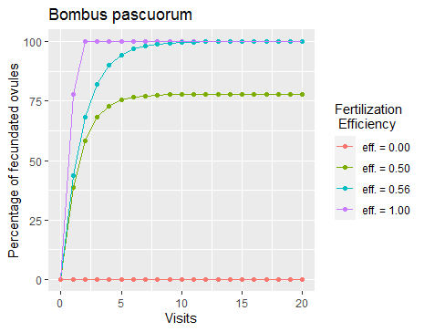

# pollinatoryield

This package includes a function for estimating a non-inflected dependence of yield on visitation rate for several crops and some their respective varieties. The non-inflected curves are given by the equation `yield = a + b * (1 - exp(-c * visit_rate))`, where `a` represents the yield without pollinators, `b` is the maximum yield attained for the crop, and `c` is a shape parameter that depends on the visits in 100 flowers during 1 hour for full fertilization (see `?shape_par_exp_decay`).

This version is still in development. So, please, report bugs, etc.

To install the package run:

```{r}
install.packages("devtools")
require(devtools)
install_github("AlfonsoAllen/pollinatoryield")
library(pollinatoryield)
```

To plot the non-inflicted curves for a given crop and their varieties, just run:

```{r}
model_eval_visitation_rate(Crop = `Crop name`, visit_rate = `number`)
```
where `Crop` is latin name of the crop (e.g. "Vaccinium corymbosum", "Fragaria x ananassa Duch.", etc.), and `visit_rate` is the visitation rate measured in the center of a given field (see `?model_eval_visitation_rate`). The curves also show the optimal visitation rate (i.e., the target visitation rate that produces 99 % of maximum yield). Here is an example.

```{r}
model_eval_visitation_rate(Crop = "Rubus idaeus", visit_rate = 15)
```


To estimate the target visitation rate we use a model that predicts the outcome of the yield of a certain crop (e.g. % seed set) based on the observed number of visits of different pollinator species. The response variable percentage of fertilized ovules (`%F`) per flower is a proxy for the outcome of the yield of the observed crop. It was assumed that every deposited pollen grain fertilizes one ovule. The formula to describe the seed set model is the following:


The parameters used in the formula are defined as follows:
* `%F`: Percentage of fertilized ovules per flower/inflorescence (assuming that every pollen grain deposited on the flower fertilizes one ovule)
* `self`: number of pollen grains present on the stigmas of the flower before the first visitation (degree of selfing) - default = 0
* `svd`: Single Visit Deposition - Pollen grains deposited on the stigmas of a flower during a single visit of a predetermined pollinator species (svd values were obtained from literature research - when the original data in the literature is given as pollen tetrads visited svd value must be multiplicated by 4 as one pollen tetrad consists of 4 pollen grains)
* `ovu`: mean number of ovules per flower of the examined crop species 
* `eff`: pollen deposition efficiency per visit; 0 < eff < 1
* `n`: number of visits
* `m`: minimum number of visits necessary to fecundate all ovules (complete fecundation)
* `H(x)`: Step function given by


Assumptions about subsequent visits:

The efficiency parameter `eff` was implemented to meet the assumption that with every subsequent visit to the same flower, the pollen deposition diminishes. The pollen deposition values obtained from literature describe the amount of pollen deposited in a single visited to a former unvisited flower, hence a flower whose stigmas had not received any pollen grains yet. The stigmatic surface was still unoccupied, and the efficiency of pollen deposition was high. In a subsequent visit a share of the stigmatic surface of the flower would already be covered with pollen grains deposited in former visits. This probably leads to a lower pollen deposition efficiency, as pollen grains could remain on the pollinator as a result of lacking contact with sticky stigma surface or pollen grains could be deposited on top of already present pollen grains, which would impede the fertilization of an ovule by the pollen grain on top. The higher the number of subsequent visits, the stronger this effect thus the lower the pollen deposition efficiency. The `eff` has to be a value between 0 and 1. When `eff = 0`, no pollen will be deposited. When `eff = 1`, `svd` will be deposited for every subsequent visit.

The minimum value for `eff` is the value which allows to fullfill the following condition:


for n tends to infinite and `|eff|<1`. That means that the value `eff` can take is a fixed value `effmin` dependending on the parameters `self`, `svd` and `ovu`: 


This minimum value for `eff` garantizes that after infinite visits a `F% = 100`. 

The equation also fits with the ecological assumption that number of ovules indirectly influences pollen deposition efficiency. We assumed that a higher mean number of ovules coincides with higher receptive stigmatic surface. That would mean that a flower with a higher number of ovules can receive pollen more efficiently because there is more unoccupied stigmatic surface. In the prior formula a high value for `ovu` will result in a higher minimum pollen deposition efficiency `effmin`. 

Finally, here is an example that show the relation between the seed set parameters.
```{r}
# We get the parameter information for a given crop
data_crop <- curve_ovule_parameters("Blueberry",0)

data_crop

# A tibble: 28 x 10
   Crop_name Crop_species    Crop_var Species           svd   ovu  self   eff target_visits min_visits
   <chr>     <chr>           <chr>    <chr>           <dbl> <dbl> <dbl> <dbl>         <dbl>      <dbl>
 1 Blueberry Vaccinium angu~ NA       Megachile rotu~  46.4    63     0 0.576            10          2
 2 Blueberry Vaccinium angu~ NA       Megachile rotu~  51.6    63     0 0.550             9          2
 3 Blueberry Vaccinium angu~ NA       Megachile rotu~ 111.     63     0 0.362             6          1
 4 Blueberry Vaccinium angu~ NA       Bombus ssp. (Q~ 202.     63     0 0.237             4          1
 5 Blueberry Vaccinium angu~ NA       Bombus ssp. (W~ 137.     63     0 0.315             5          1
 6 Blueberry Vaccinium angu~ NA       Andrena ssp.    185.     63     0 0.254             4          1
 7 Blueberry Vaccinium angu~ NA       Halictus ssp.   103.     63     0 0.379             6          1
 8 Blueberry Vaccinium angu~ NA       Apis mellifera   46.8    63     0 0.574            10          2
 9 Blueberry Vaccinium angu~ Aiton    Anthonophora p~  30      63     0 0.677            14          3
10 Blueberry Vaccinium angu~ Aiton    Bombus impatie~  40      63     0 0.612            11          2
# ... with 18 more rows

# We plot the dependence of the percentage of fecundated ovules on the number of visits for a given floral visitor of our target crop
i=14 # Visitor: Colletes sp. 

example_1 <- tibble(visits=c(0:60),
                    percentage_fecundated_ovules = evolution_ovules(data_crop$svd[i],
                                                                    data_crop$ovu[i],
                                                                    data_crop$self[i],1,c(0:60)),
                    efficiency = paste0("eff. = 1.00"))

example_2 <- tibble(visits=c(0:60),
                    percentage_fecundated_ovules = evolution_ovules(data_crop$svd[i],
                                                                    data_crop$ovu[i],
                                                                    data_crop$self[i],data_crop$eff[i],c(0:60)),
                    efficiency = paste0("eff. = ",round(data_crop$eff[i],2)))

example_3 <- tibble(visits=c(0:60),
                    percentage_fecundated_ovules = evolution_ovules(data_crop$svd[i],
                                                                    data_crop$ovu[i],
                                                                    data_crop$self[i],0.5,c(0:60)),
                    efficiency = paste0("eff. = 0.50"))

example_4 <- tibble(visits=c(0:60),
                    percentage_fecundated_ovules = evolution_ovules(data_crop$svd[i],
                                                                    data_crop$ovu[i],
                                                                    data_crop$self[i],0,c(0:60)),
                    efficiency = paste0("eff. = 0.00"))


ggplot(bind_rows(example_1,example_2,example_3,example_4), 
       aes(x=visits,y=percentage_fecundated_ovules,color =efficiency))+
  geom_point()+
  geom_line()+
  labs(x="Visits",y="Percentage of fecundated ovules",
       color="Fertilization\n Efficiency",
       title = data_crop$Species[i])
```

